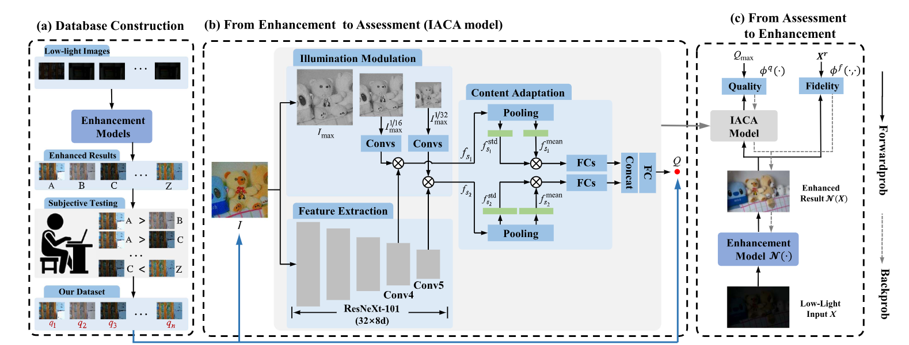

# [TMM'23] IACA_IQA
Official Pytorch implementation of **Gap-Closing Matters: Perceptual Quality Evaluation and Optimization of Low-Light Image Enhancement**.

Baoliang Chen and Lingyu Zhu contributed equally to this work.

[Baoliang Chen*](https://scholar.google.com/citations?user=w_WL27oAAAAJ&hl=zh-CN),
[Lingyu Zhu*](https://scholar.google.com/citations?user=IhyTEDkAAAAJ&hl=zh-CN),
[Hanwei Zhu](https://scholar.google.com/citations?user=-52izjkAAAAJ&hl=zh-CN),
[Wenhan Yang](https://scholar.google.com/citations?user=S8nAnakAAAAJ&hl=zh-CN),
[Linqi Song](https://scholar.google.com.tw/citations?user=UcGN3MoAAAAJ&hl=en),
[Shiqi Wang](https://scholar.google.com/citations?user=Pr7s2VUAAAAJ&hl=zh-CN)


## Abstract
There is a growing consensus in the research community that the optimization of low-light image enhancement approaches should be guided by the visual quality perceived by end users. Despite the substantial efforts invested in the design of low-light enhancement algorithms, there has been comparatively limited focus on assessing subjective and objective quality systematically. To mitigate this gap and provide a clear path towards optimizing low-light image enhancement for better visual quality, we propose a gap-closing framework. In particular, our gap-closing framework starts with the creation of a largescale dataset for Subjective QUality Assessment of REconstructed LOw-Light Images (SQUARE-LOL). This database serves as the foundation for studying the quality of enhanced images and conducting a comprehensive subjective user study. Subsequently, we propose an objective quality assessment measure that plays a critical role in bridging the gap between visual quality and enhancement. Finally, we demonstrate that our proposed objective quality measure can be incorporated into the process
of optimizing the learning of the enhancement model toward perceptual optimality. We validate the effectiveness of our proposed framework through both the accuracy of quality prediction and the perceptual quality of image enhancement.


## Overview
<p align="left">

</p>

## Project Setup

You can refer to more details from [IACA_For_Lowlight_IQA](https://github.com/Baoliang93/IACA_For_Lowlight_IQA).

## Citation Information
If you find the project useful, please cite:
```
@article{chen2023gap,
  title={Gap-Closing Matters: Perceptual Quality Evaluation and Optimization of Low-Light Image Enhancement},
  author={Chen, Baoliang and Zhu, Lingyu and Zhu, Hanwei and Yang, Wenhan and Song, Linqi and Wang, Shiqi},
  journal={IEEE Transactions on Multimedia},
  year={2023},
  publisher={IEEE}
}
```

